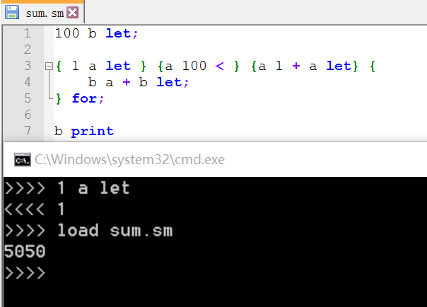

# Simple Math Script
------
本来的目的是给师弟们的逆波兰表达式的作业写一个样例。  
结果越写了一个小时发现越写越多，自己控制不住自己了#滑稽  

> * 计算表达式如 1 2 + 3 *，支持： + * - / ^（乘方） > < = |（逻辑或） &（逻辑与）
> * 关键字 let：expr variable let，比如1 a let
> * 关键字 for：{ start } { cond } { step } { body } for，比如：{ 1 i let } {i 100 < } {i 1 + i let} { b a + b let; } for;
> * 关键字 if：{cond} {then} {else} if：{cond}
> * 关键字 break：跳出for循环
> * 关键字 print：打印一个值
> * 大括号（{ }）括住的部分称为block，在不需要的时候并不会求值
> * “ ; ”也是一个运算符，用途是弹出栈顶元素但是不压任何东西栈，让代码看起来像是C一点#滑稽
> * 在交互界面输入quit可以退出，load filename可以执行外部文件。

